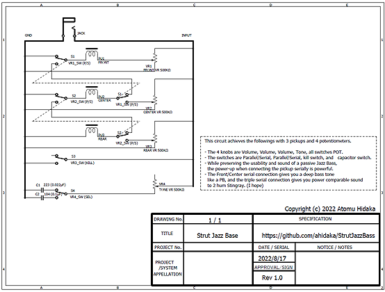

# StrutJazzBass
Strut Jazz Bass Circuit

This circuit achieves the following with 3 pickups and 4 potentiometers.

- The 4 knobs are Volume, Volume, Volume, Tone, all switches POT.
- The switches are Parallel/Serial, Parallel/Serial, kill switch, and capacitor switch.
- While preserving the usability and sound of a passive Jazz Bass, the power-up when connecting the pickup serially is powerful.
- The Front/Center serial connection gives you a deep bass tone like a PB, and the triple serial connection gives you power comparable sound to 2 hum Stingray. (I hope)

This electric base used in the prototype was manufactured by ELK incorporated in 1973 in Japan.

## Circuit Diagram

## Prototype Picture

### Front View

### Back View

### Head

### Body

### Electric_Circuit

### Work

## Special THanks

This work was submitted to a [modified guitar contest held by TC Gakki](https://tcgakki.com/pages/modified-guitar-contest-2022).

https://tcgakki.com/pages/modified-guitar-contest-2022

